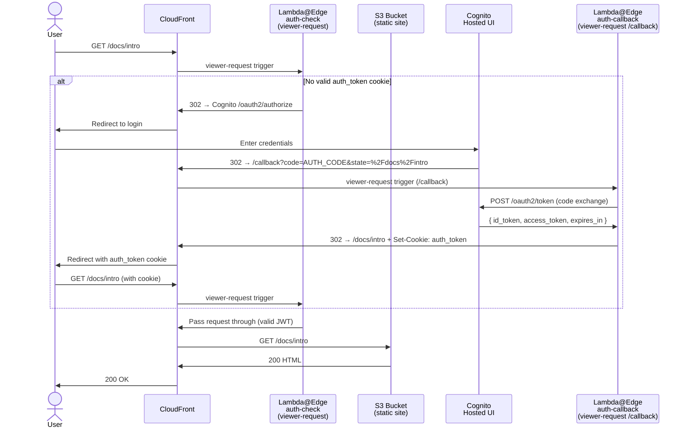

# docusaurus-cognito-auth

[](https://github.com/biscolab/docusaurus-cognito-auth/actions/workflows/deploy.yml)
[](https://nodejs.org)
[](https://aws.amazon.com/serverless/sam/)
[](LICENSE)

> **Protect any static site with enterprise-grade auth in minutes.**

A fully serverless authentication layer that gates any static site hosted on **S3 + CloudFront** behind **AWS Cognito** login — without touching your site's code or build pipeline.

**This repository is the auth layer only.** The static site (Docusaurus, Next.js, plain HTML — anything) is deployed independently to the S3 bucket provisioned by this stack. Swap the site whenever you like without redeploying auth.

---

## Architecture



---

## How It Works

| Step | Component                | What happens                                                       |
| ---- | ------------------------ | ------------------------------------------------------------------ |
| 1    | **CloudFront**           | Every request hits the distribution first                          |
| 2    | **auth-check Lambda**    | Extracts `auth_token` cookie, verifies JWT via Cognito JWKS        |
| 3a   | **Valid token**          | Request passes through to S3 transparently                         |
| 3b   | **No / expired token**   | 302 redirect to Cognito Hosted UI login page                       |
| 4    | **Cognito**              | User logs in; Cognito redirects to `/callback?code=…`              |
| 5    | **auth-callback Lambda** | Exchanges code for tokens; sets `HttpOnly; Secure` cookie          |
| 6    | **User**                 | Redirected back to the originally requested URL, now authenticated |

Subsequent requests skip steps 4–6 — the cookie is validated in ~1 ms at the edge.

---

## Lambda Functions & CloudFront Events

### CloudFront event types

CloudFront can fire a Lambda@Edge function at four points in the request/response lifecycle:

```
Browser ──► [viewer-request] ──► CloudFront cache ──► [origin-request] ──► S3
Browser ◄── [viewer-response] ◄── CloudFront cache ◄── [origin-response] ◄── S3
```

This project uses **viewer-request** only — it fires on every inbound request, before the cache is checked and before S3 is ever contacted. This is the right trigger when you need to gate access unconditionally (cached or not).

---

### auth-check — viewer-request on every path (`*`)

**When it fires:** CloudFront receives any request to your distribution (e.g. `GET /docs/intro`, `GET /assets/main.js`).

**What CloudFront passes to the function:**

```js
{
  Records: [
    {
      cf: {
        request: {
          uri: '/docs/intro',
          querystring: '',
          method: 'GET',
          headers: {
            cookie: [{ key: 'Cookie', value: 'auth_token=eyJ...' }],
            host: [{ key: 'Host', value: 'd1234abcd.cloudfront.net' }],
          },
        },
      },
    },
  ];
}
```

**What the function can return:**

| Return value                                   | Effect                                                            |
| ---------------------------------------------- | ----------------------------------------------------------------- |
| The original `request` object                  | CloudFront continues — checks cache, then fetches from S3         |
| A response object (`{ status, headers, ... }`) | CloudFront returns that response directly — S3 is never contacted |

**Logic:**

```
cookie present?
  ├─ No  → return 302 response → Cognito login URL (S3 never reached)
  └─ Yes → validate JWT (signature, expiry, issuer, audience)
              ├─ Valid   → return original request → S3 serves the page
              └─ Invalid → return 302 response → Cognito login URL + clear cookie
```

---

### auth-callback — viewer-request on `/callback` only

**When it fires:** CloudFront receives `GET /callback?code=AUTH_CODE&state=%2Fdocs%2Fintro`. This path has its own `CacheBehavior` in the SAM template that points exclusively to this function — `auth-check` never sees `/callback` requests.

**What CloudFront passes to the function:**

```js
{
  Records: [
    {
      cf: {
        request: {
          uri: '/callback',
          querystring: 'code=AUTH_CODE&state=%2Fdocs%2Fintro',
          method: 'GET',
          headers: {},
        },
      },
    },
  ];
}
```

**What the function does:**

1. Parses `code` and `state` from the querystring
2. Makes a server-side `POST` to `https://<cognito-domain>/oauth2/token` with the code
3. Receives `{ id_token, access_token, expires_in }` from Cognito
4. Returns a 302 response with a `Set-Cookie` header (never touches S3):

```js
{
  status: '302',
  headers: {
    location:   [{ key: 'Location',  value: '/docs/intro' }],    // decoded from state
    'set-cookie': [{ key: 'Set-Cookie',
                     value: 'auth_token=eyJ...; HttpOnly; Secure; SameSite=Lax; Path=/; Max-Age=3600' }]
  }
}
```

The browser stores the cookie and follows the redirect to `/docs/intro`. The next request hits `auth-check` with a valid cookie and goes straight through to S3.

---

### How the two functions are wired in CloudFront

Defined in `template.yaml`:

```yaml
# auth-check fires on every request
DefaultCacheBehavior:
  LambdaFunctionAssociations:
    - EventType: viewer-request
      LambdaFunctionARN: !Ref AuthCheckFunctionAliaslive

# auth-callback fires only on /callback — evaluated before DefaultCacheBehavior
CacheBehaviors:
  - PathPattern: /callback
    LambdaFunctionAssociations:
      - EventType: viewer-request
        LambdaFunctionARN: !Ref AuthCallbackFunctionAliaslive
```

CloudFront evaluates `CacheBehaviors` path patterns first, most-specific wins. A request to `/callback` matches the explicit pattern and is handled entirely by `auth-callback`. Every other path falls through to `DefaultCacheBehavior` and is handled by `auth-check`.

---

## Prerequisites

- [AWS CLI v2](https://docs.aws.amazon.com/cli/latest/userguide/install-cliv2.html) configured with a named profile
- [AWS SAM CLI](https://docs.aws.amazon.com/serverless-application-model/latest/developerguide/install-sam-cli.html) ≥ 1.100
- Node.js 22.x (`node --version`)
- Deployment region must be **us-east-1** (Lambda@Edge requirement)

---

## Quick Start

### 1. Clone and install

```bash
git clone https://github.com/biscolab/docusaurus-cognito-auth.git
cd docusaurus-cognito-auth
npm install
```

### 2. Configure `samconfig.toml`

Open `samconfig.toml` and set your values:

```toml
[default.deploy.parameters]
region  = "us-east-1"
profile = "your-aws-profile"        # AWS CLI profile to use
parameter_overrides = [
  "CognitoDomainPrefix=your-unique-prefix",   # globally unique across all AWS accounts
]
```

### 3. Deploy

```bash
npm run deploy
```

The script handles everything automatically:

1. **First deploy** — provisions CloudFront, Cognito, S3, and Lambda@Edge with a placeholder callback URL.
2. **Reads CloudFormation outputs** — retrieves `CloudFrontDomain`, `UserPoolId`, and `UserPoolClientId` and writes them to `.env` automatically.
3. **Second deploy** — detects that `CALLBACK_URL` changed, rebuilds Lambda with the real values, and updates the Cognito app client.

At the end of the script you will see:

```
==> All done!
    Site:          https://d1234abcd.cloudfront.net
    Cognito login: https://your-prefix.auth.us-east-1.amazoncognito.com/login?...
    S3 bucket:     docusaurus-cognito-auth-sitebucket-xxxx
```

### 4. Upload your static site

```bash
aws s3 sync ./your-site-build s3://$(aws cloudformation describe-stacks \
  --stack-name docusaurus-cognito-auth \
  --query 'Stacks[0].Outputs[?OutputKey==`SiteBucketName`].OutputValue' \
  --output text) --delete --profile your-aws-profile
```

Visit `https://YOUR_CLOUDFRONT_DOMAIN` — you will be redirected to the Cognito login page.

### Subsequent deploys

Any code or configuration change is deployed with the same single command:

```bash
npm run deploy
```

`.env` is updated automatically after every deploy.

---

## Configuration Reference

`.env` is written automatically by `npm run deploy` after every deployment. You should not need to edit it manually.

| Variable         | Description                         | Source                                                      |
| ---------------- | ----------------------------------- | ----------------------------------------------------------- |
| `AWS_REGION`     | AWS region (always `us-east-1`)     | `samconfig.toml`                                            |
| `USER_POOL_ID`   | Cognito User Pool ID                | CloudFormation output `UserPoolId`                          |
| `CLIENT_ID`      | Cognito App Client ID               | CloudFormation output `UserPoolClientId`                    |
| `COGNITO_DOMAIN` | Full Cognito domain (no `https://`) | `CognitoDomainPrefix` + `.auth.us-east-1.amazoncognito.com` |
| `CALLBACK_URL`   | CloudFront URL + `/callback`        | CloudFormation output `CloudFrontDomain`                    |

**SAM template parameters** (set in `samconfig.toml`):

| Parameter              | Default                | Description                                         |
| ---------------------- | ---------------------- | --------------------------------------------------- |
| `CognitoDomainPrefix`  | —                      | Globally unique Hosted UI prefix (set by you)       |
| `CallbackUrl`          | auto                   | Injected automatically by `deploy.sh` from `.env`   |
| `CognitoUserPoolName`  | `docusaurus-auth-pool` | Display name for the User Pool                      |
| `CloudFrontPriceClass` | `PriceClass_100`       | `PriceClass_100` (US/EU), `PriceClass_All` (global) |

---

## Deploying Your Static Site

This stack provisions an **empty S3 bucket**. Deploy your static site files independently:

```bash
# Docusaurus
npm run build                # builds to ./build
aws s3 sync ./build s3://$(aws cloudformation describe-stacks \
  --stack-name docusaurus-cognito-auth \
  --query 'Stacks[0].Outputs[?OutputKey==`SiteBucketName`].OutputValue' \
  --output text) --delete

# Invalidate CloudFront cache after upload
aws cloudfront create-invalidation \
  --distribution-id $(aws cloudformation describe-stacks \
    --stack-name docusaurus-cognito-auth \
    --query 'Stacks[0].Outputs[?OutputKey==`CloudFrontDistributionId`].OutputValue' \
    --output text) \
  --paths "/*"
```

Any static site generator works — the auth layer is completely site-agnostic.

---

## GitHub Actions CI/CD

Set the following **repository secrets** to enable automated deployments on push to `main`:

| Secret                  | Description                            |
| ----------------------- | -------------------------------------- |
| `AWS_DEPLOY_ROLE_ARN`   | IAM Role ARN for OIDC-based deployment |
| `USER_POOL_ID`          | Cognito User Pool ID                   |
| `CLIENT_ID`             | Cognito App Client ID                  |
| `COGNITO_DOMAIN`        | Full Cognito domain                    |
| `COGNITO_DOMAIN_PREFIX` | Hosted UI prefix                       |
| `CALLBACK_URL`          | CloudFront callback URL                |

The workflow uses OIDC (no long-lived access keys). Create an IAM role that trusts `token.actions.githubusercontent.com` and has `sam deploy` permissions.

---

## Development

```bash
npm install          # install all dependencies
npm test             # run unit tests
npm run test:coverage  # run tests with coverage report (must be ≥ 80%)
npm run lint         # check ESLint
npm run format       # auto-format with Prettier
```

---

## Cost Estimate

All components fit comfortably within AWS Free Tier for low-traffic sites:

| Service         | Free Tier                        | Pay-as-you-go                    |
| --------------- | -------------------------------- | -------------------------------- |
| **CloudFront**  | 1 TB data + 10M requests/month   | $0.0085/10K HTTPS requests       |
| **Lambda@Edge** | 1M requests + 400,000 GB-s/month | $0.60/M requests + $0.00001/GB-s |
| **Cognito**     | 50,000 MAU free                  | $0.0055/MAU after                |
| **S3**          | 5 GB storage + 20K GET/month     | $0.023/GB + $0.0004/10K GET      |

**Estimated cost for 10,000 users/month:** ~$0–$5 USD, dominated by Cognito MAU if you exceed the free tier.

---

## Logout

To log out, redirect the user to:

```
https://YOUR_CLOUDFRONT_DOMAIN/logout
```

The `auth-check` Lambda handles the `/logout` path directly — no static file needed in S3:

1. Clears the `auth_token` cookie (`Max-Age=0`)
2. Redirects to the Cognito logout endpoint, which invalidates the Cognito session
3. Cognito redirects back to the site root
4. The next request triggers a new login

To add a logout button to your static site:

```html
<a href="/logout">Logout</a>
```

---

## Security Notes

- JWTs are verified at the edge using Cognito's JWKS endpoint (RS256 signature, expiry, issuer, audience)
- Cookies are `HttpOnly; Secure; SameSite=Lax` — not accessible from JavaScript
- The S3 bucket is fully private; CloudFront accesses it via OAC (no public ACLs)
- The Cognito App Client is configured as a **public client** (no client secret) — appropriate for Lambda@Edge where secrets cannot be stored securely
- Config values are baked at build time; never committed to source control

---

## Disclaimer

This project is provided **as-is**, without warranty of any kind, express or implied. By using this code you accept full responsibility for any outcome — including but not limited to security breaches, data loss, unexpected AWS charges, or misconfigured access controls.

- **Use at your own risk.** Review every component before deploying to production.
- **No security guarantee.** While the architecture follows AWS best practices, no authentication system is unconditionally secure. You are responsible for validating that it meets your organisation's security requirements.
- **No support obligation.** The author is not liable for any direct, indirect, incidental, or consequential damages arising from the use of this software.

---

## Author

Built by **[Roberto Belotti](https://www.linkedin.com/in/robertobelotti)** · [GitHub](https://github.com/biscolab)

---

## License

[MIT](LICENSE.md) © Roberto Belotti
